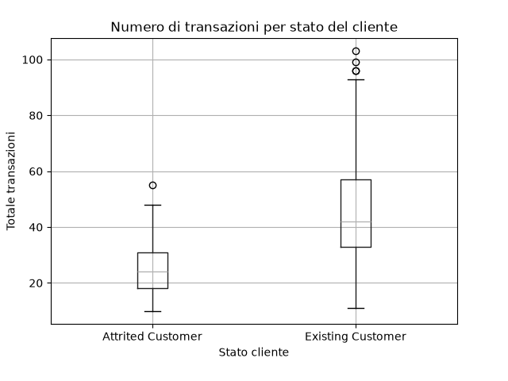

# Analisi Customer Churn - Settore Bancario

Progetto di data analysis end-to-end su un dataset di clienti bancari, con l'obiettivo di capire quali fattori sono legati all'abbandono (churn) dei clienti dai servizi di carta di credito.

## Domanda di business

Quali clienti rischiano di abbandonare la banca, e quali caratteristiche li contraddistinguono rispetto ai clienti che restano?

## Dataset

- **Fonte**: Credit Card Customers Dataset (Kaggle, originariamente da LEAPS Analyttica)
- **Dimensioni**: 2.998 righe, 23 colonne originali
- **Target**: `Attrition_Flag` (Existing Customer / Attrited Customer)

## Struttura del progetto

```
bank-churn-project/
├── data/
│   ├── raw/
│   └── processed/
├── scripts/
└── README.md
```

## Cosa è stato fatto finora

**1. Pulizia dati**
- Rimosse colonne di data leakage (`classification`, `Naive_Bayes_Classifier`), risultato di un modello predittivo pre-esistente e non dati reali
- Verificata assenza di valori mancanti (0 su tutte le colonne)
- Verificata assenza di righe duplicate (controllo su `CLIENTNUM`)
- Controllati outlier tramite statistiche descrittive (`describe()`) e visualizzazioni (istogrammi)
- Dataset pulito salvato in `data/processed/bank_churners_clean.csv`

## Strumenti utilizzati

- Python (pandas, matplotlib)
- Git / GitHub


## Risultati preliminari EDA

Il numero di transazioni annuali è nettamente più basso nei clienti che abbandonano rispetto a quelli che restano:


## Analisi SQL

Le stesse domande di business sono state verificate anche con query SQL su SQL Server (vedi `sql/analisi_churn.sql`):
- Tasso di abbandono complessivo
- Confronto transazioni e relazioni bancarie tra clienti rimasti e abbandonati
- Tasso di abbandono per fascia di reddito

## Dashboard Power BI

Dashboard interattiva con i risultati principali dell'analisi:


Il file sorgente è disponibile in `dashboard/bank_churn_dashboard.pbix`.
